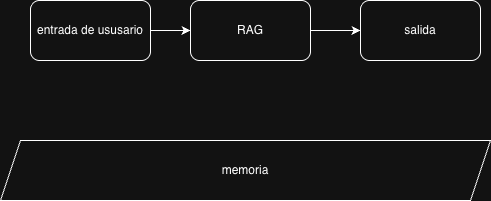
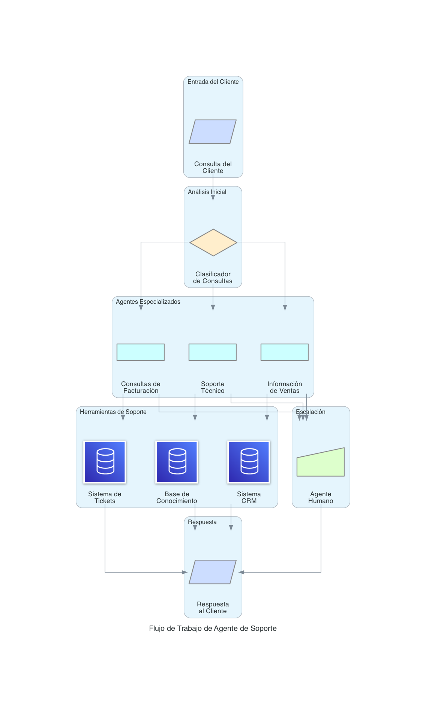

# Agentes de IA con LangGraph: Guía Completa

## ¿Qué es LangGraph?

LangGraph es una biblioteca para construir aplicaciones con estado y múltiples actores utilizando Modelos de Lenguaje Grande (LLMs). Extiende el lenguaje de expresión de LangChain con la capacidad de coordinar múltiples cadenas (o actores) a través de múltiples pasos de computación de manera cíclica.

### Características Principales:
- **Con Estado**: Mantiene el estado entre pasos
- **Multi-actor**: Soporta múltiples agentes trabajando juntos
- **Flujos Cíclicos**: Permite bucles y ramificación condicional
- **Humano en el Bucle**: Soporte integrado para intervención humana
- **Persistencia**: Puede guardar y reanudar flujos de trabajo

### Componentes Centrales:
- **Nodos**: Unidades de procesamiento individuales (agentes, herramientas, funciones)
- **Aristas**: Conexiones entre nodos que definen el flujo
- **Estado**: Estructura de datos compartida que se pasa entre nodos
- **Grafo**: La estructura general del flujo de trabajo

## Conceptos de Agentes de IA

### 1. Router (Enrutadores)

Un router es responsable de decidir qué camino o acción tomar basándose en el estado actual y la entrada. Actúa como un componente de toma de decisiones que dirige el flujo de ejecución.

**Características Clave:**
- Analiza la entrada y el contexto
- Toma decisiones de enrutamiento
- Puede usar LLMs para enrutamiento inteligente
- Soporta lógica condicional

**Casos de Uso:**
- Dirigir consultas de usuarios a agentes especializados apropiados
- Elegir entre diferentes pipelines de procesamiento
- Implementar árboles de decisión de múltiples pasos

### 2. Herramientas (Tools)

Las herramientas son funciones o servicios externos que los agentes pueden invocar para realizar tareas específicas. Extienden las capacidades de los LLMs más allá de la generación de texto.

**Tipos de Herramientas:**
- **Llamadas API**: Integraciones con servicios externos
- **Consultas de base de datos**: Recuperación y manipulación de datos
- **Operaciones de archivos**: Lectura, escritura, procesamiento de archivos
- **Cálculos**: Computaciones matemáticas
- **Web scraping**: Recopilación de información de sitios web

**Integración de Herramientas:**
- Las herramientas se definen con esquemas que describen entradas/salidas
- Los agentes pueden seleccionar e invocar herramientas dinámicamente
- Los resultados se incorporan de vuelta al flujo de trabajo

### 3. Humano en el Bucle (Human-in-the-Loop)

Humano en el bucle (HITL) permite la intervención humana en puntos específicos del flujo de trabajo del agente. Esto es crucial para:

**Beneficios:**
- **Control de calidad**: Supervisión humana para decisiones críticas
- **Corrección de errores**: Los humanos pueden corregir errores del agente
- **Flujos de aprobación**: Requieren aprobación humana para acciones
- **Aprendizaje**: Los humanos pueden proporcionar retroalimentación para mejoras

**Patrones de Implementación:**
- **Puntos de interrupción**: Pausar la ejecución para entrada humana
- **Puertas de aprobación**: Requieren confirmación humana
- **Bucles de retroalimentación**: Recopilar retroalimentación humana para mejora del modelo
- **Mecanismos de anulación**: Permitir que los humanos cambien decisiones del agente

## Patrones de Flujo de Trabajo en LangGraph

### Flujo Lineal Básico
```
Entrada → Agente → Herramienta → Salida
```



Este patrón ilustra cómo se integra la supervisión humana en el flujo de trabajo, permitiendo revisión y corrección antes de ejecutar acciones críticas.
### Sistema Multi-Agente con Herramientas


## Casos de Uso Comunes

### Agente de Soporte al Cliente


- Router determina el tipo de consulta
- Agentes especializados manejan diferentes categorías
- Herramientas acceden a bases de conocimiento y sistemas CRM
- Escalación humana para problemas complejos

### Pipeline de Análisis de Datos
- Router basado en tipo de datos
- Diferentes agentes de procesamiento para varios formatos
- Herramientas para transformación y análisis de datos
- Revisión humana para insights críticos

### Flujo de Trabajo de Generación de Contenido
- Router determina el tipo de contenido
- Agentes especializados para diferentes formatos
- Herramientas para investigación y verificación de hechos
- Aprobación humana antes de publicar


## Métricas y Evaluación

### Métricas de Rendimiento
- **Tiempo de respuesta**: Latencia del sistema
- **Precisión**: Corrección de las decisiones del router
- **Tasa de éxito**: Porcentaje de tareas completadas exitosamente

### Métricas de Calidad
- **Satisfacción del usuario**: Retroalimentación y calificaciones
- **Tasa de escalación**: Frecuencia de intervención humana
- **Precisión de herramientas**: Corrección de resultados de herramientas
- **Coherencia**: Consistencia en respuestas similares

## Conclusión

LangGraph proporciona un marco poderoso para construir sistemas de agentes de IA sofisticados. Al combinar routers, herramientas y patrones de humano en el bucle, puedes crear flujos de trabajo de IA robustos, confiables y controlables que pueden manejar escenarios complejos del mundo real.

Este enfoque permite construir sistemas de IA que son tanto poderosos como confiables, adecuados para entornos de producción donde la confiabilidad y la supervisión humana son esenciales.

## Recursos Adicionales

### Documentación Oficial
- [LangGraph Documentation](https://langchain-ai.github.io/langgraph/)
- [LangChain Documentation](https://python.langchain.com/)